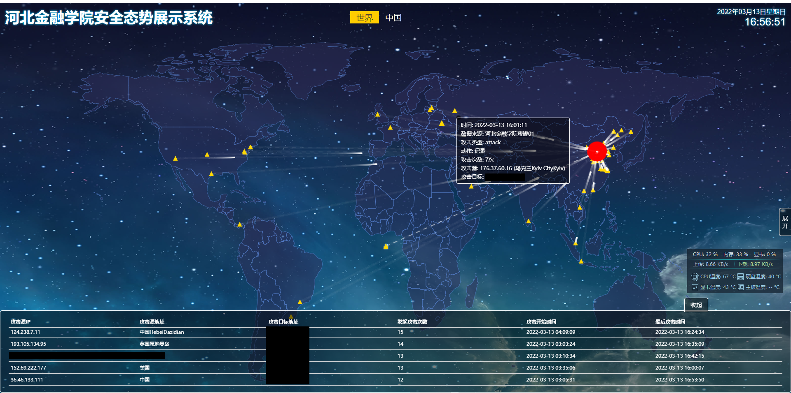

<h2 align="center">attackMap</h2>
<h3 align="center">A Self-Hosted Awesome Network Attack Map | 可以自建的酷炫网络攻击地图</h3>

    

------

# 简介

[前往导航](#导航)

你可能看过很多酷炫的网络攻击地图，就像卡巴斯基的[这个](https://cybermap.kaspersky.com/)，但是一直没有什么开源的、能够自建的网络攻击地图，本项目就能为你带来为你的网络量身定做的网络攻击地图

# 导航

- [如何使用](#如何使用)
- [预览](#预览)
- [其它开源项目](#其它开源项目)

# 如何使用

[返回导航](#导航)

请参考[文档站](https://luckykeeper.github.io/attackMap/)进行部署

# 预览

[返回导航](#导航)

本项目没有在线 demo ，效果可以参考[这里](https://atkmap.luckykeeper.site/)（和实际效果略有差别）

以下是实际运行截图（图中的敏感信息已经打码处理）

# 其它开源项目

[返回导航](#导航)

> 使用 Ren'Py 重制 LOVEPOTION SIXTYNINE ，并加以汉化和全平台移植
>
> https://github.com/luckykeeper/LOVE69_renpy_remaster 
>
> 个人博客容器镜像
>
> https://github.com/luckykeeper/docker_plumemo

# Stargazers over time 

[返回导航](#导航)

